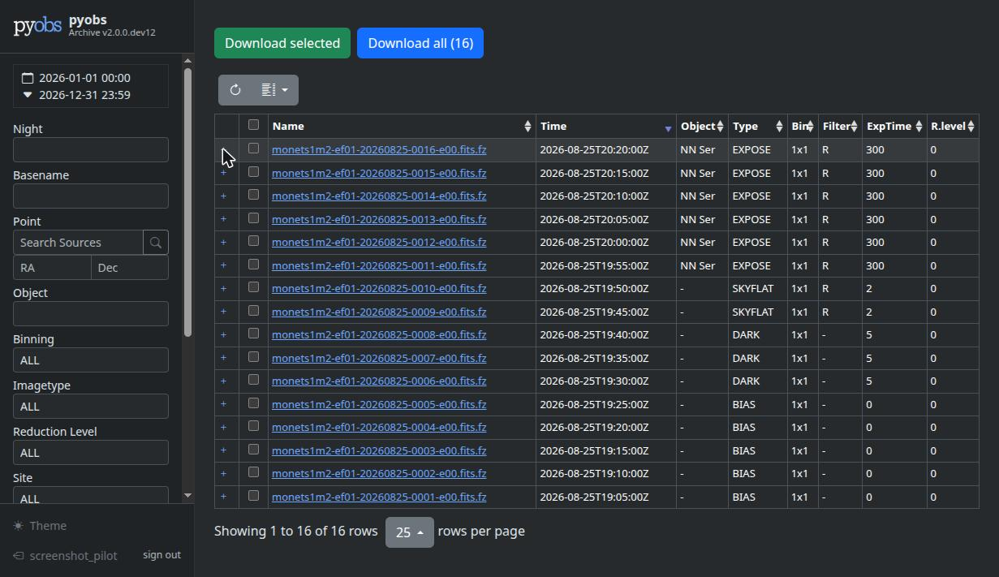
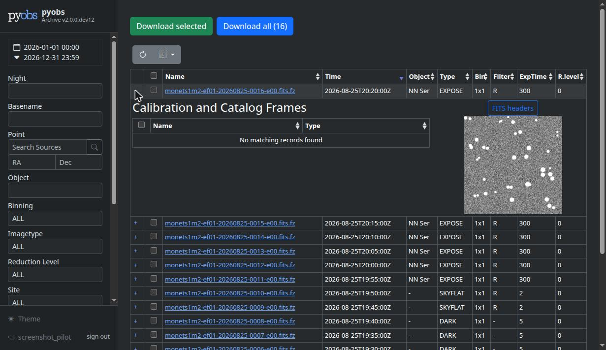

pyobs-archive
#############

*pyobs-archive* is a stand-alone archive for FITS images. It provides a general look & feel and a
REST API similar to the one used by the `LCO archive <https://developers.lco.global/#archive>`_,
and (optionally) restricts frame access to project members via a pyobs-portal connection.

Screenshots
===========

The frame browser, with a filter sidebar and sortable, filterable table of frames:

         EXPOSE frames.
   :width: 100%

A frame's row expanded, showing its calibration/catalog frames and a live preview:

         star field.
   :width: 100%

.. toctree::
   :maxdepth: 1

   installation
   configuration
   architecture
   api
   development
